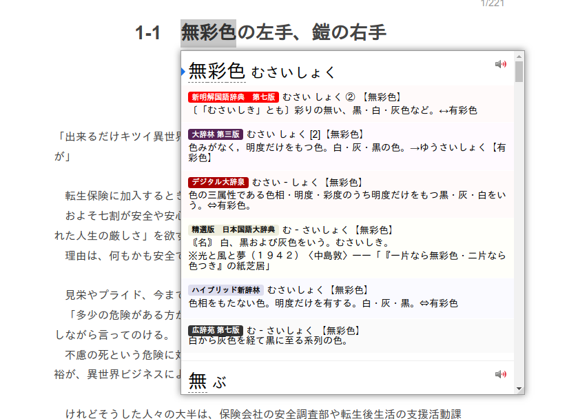
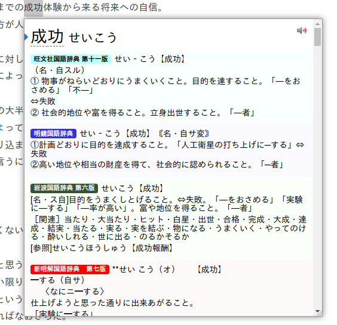

# yomichan-dict-css

Yomichan custom CSS to color dictionaries by name. This currently supports most significant Japanese as well as Chinese/Cantonese dictionaries that are available for Yomichan.

Please only obtain dictionaries by legal means.

## Instructions

Paste the contents of [custom.css](custom.css) in the "Configure custom CSS…" area of yomichan settings. To achieve a more compact look on dictionary entries like in the below screenshots, you may additionally paste in the contents of [compact.css](compact.css).

## Contributing

Feel free to send PRs which add new dicts. In general, try to select colors which match the dictionary's logo/icon.

## Examples

